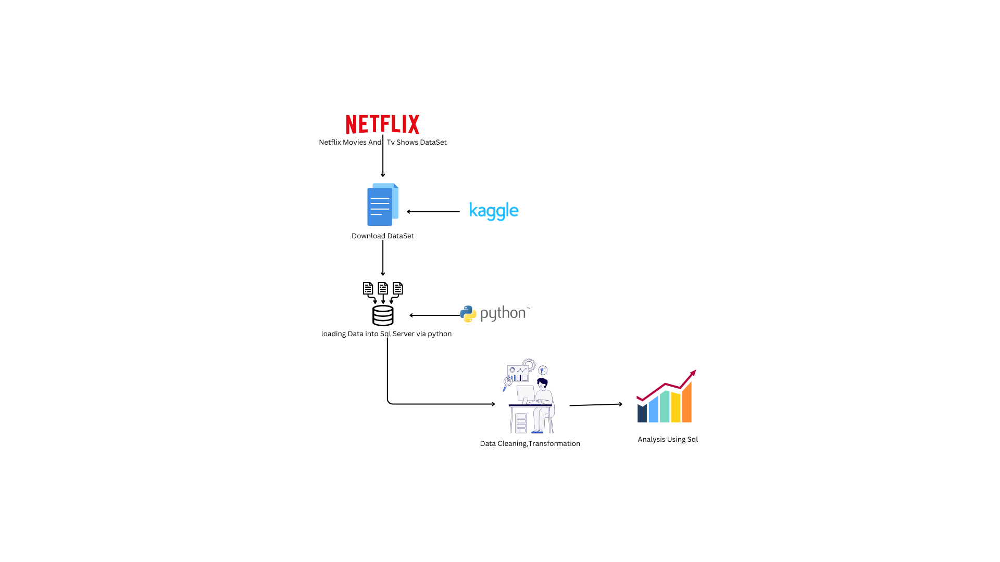

# 📌 Netflix Data Analysis Pipeline  

  

This project focuses on analyzing **Netflix Movies and TV Shows data** using **Python, SQL Server, and SQL queries**.  
The dataset is sourced from **Kaggle**, ingested into **SQL Server**, cleaned, transformed, and analyzed to derive insights.  

## 🔹 Tech Stack  
- Python 🐍  
- SQL Server 🗄️  
- Kaggle Dataset 📂  

## 🔹 Key Steps  
✔️ **Data Ingestion** – Downloading & Loading into SQL Server  
✔️ **Cleaning & Transformation** – Data Preprocessing  
✔️ **SQL Analysis** – Querying & Insights Extraction  

## 🔹 Use Case  
- 📊 Analyzing Netflix content trends  
- 🎬 Categorizing movies and TV shows  
- 📈 Exploring content distribution insights  

📌 **Check out the repository and feel free to contribute!** 🚀  

